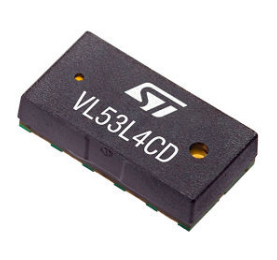
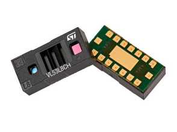
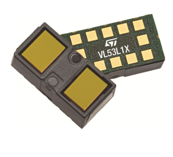
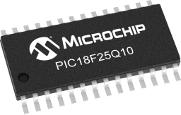
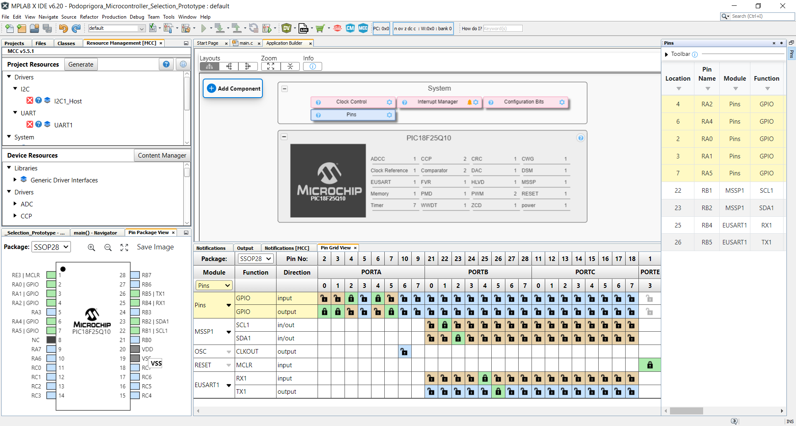
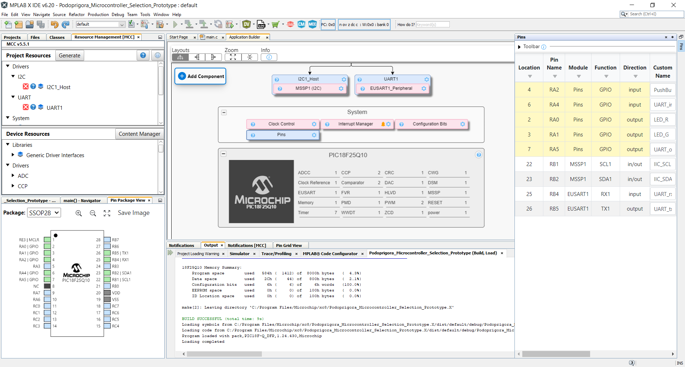

# 1. Major Component Selection

## Inroduction to the Component Selection Process
The type of sensor proposed and selected earlier for this semester’s group project is a **distance measuring** sensor. Nowadays, a variety of physical phenomena is utilised to create this type of sensors, including, but not limited to: infrared emitting, ultrasonic “listening” and laser-based detection. Taking into account the guidelines of the current project, the sensor selection process was performed under the following considerations: the sensor chip should incorporate at least 1 serial communication protocol; the sensor chip should not come from the manufacturer as a part of “daughterboard”-type PCB, unless the chip itself is too small to be manually soldered on the self-designed PCB. The results of this selection are presented below: 

## Distance Sensor Module

| **Solution**                                                                                                                                                                                      | **Pros**                                                                                                                                    | **Cons**                                                                                            |
| ------------------------------------------------------------------------------------------------------------------------------------------------------------------------------------------------- | ------------------------------------------------------------------------------------------------------------------------------------------- | --------------------------------------------------------------------------------------------------- |
|  Option 1.  VL53L4CD Time-of-Flight high accuracy low power proximity sensor $1/each [link to product](https://www.digikey.com/en/products/detail/stmicroelectronics/VL53L4CDV0DH-1/16123783?s=N4IgTCBcDaIGoBkCsBmBAWAwgERAXQF8g)                 | \* Provides up to 1.3 meters of scanning distance range \* Extremely compact and miniature (4.4 x 2.4 x 1 mm size) \* Successfully operates under the standardized power supply of 3.3 Volts \* Capable of reaching the communication frequency up to 1 MHz (I2C-based) \* Incorporates a system driver based on the so-called “Ultra Light Driver” (ULD) - an API set developed by manufacturer(STMicroelectronics) as a uniform solution for various sensor models, that is actively supported and updated| \* Comes in a Land Grid Array(LGA)-type packaging, which is expected to be hard for traditional(solder iron-based) soldering (12 pins in total) \* Provides Field of View(FoV) angle of only 18 degrees within a single plane |
|  \* Option 2.  \* VL53L8CH high performance 8x8 multi zone Time-of-Flight (ToF) sensor  \* $8.53/each  \* [Link to product](https://www.digikey.com/en/products/detail/stmicroelectronics/VL53L8CHV0GC-1/21191534?s=N4IgTCBcDaIGoBkCsBmBAOAwgCRAXQF8g) | \* Capable of performing scanning within a broad FoV, reaching the detection range within 45 degrees across the center of the sensor both in vertical and horizontal planes  \* Supports both I2C and SPI interfaces for communication with the Host MCU   \* Capable of detecting objects located as far as 4 meters(!) from the sensor | \* Comes in a Land Grid Array(LGA)-type packaging, which is expected to be hard for traditional(solder iron-based) soldering (17 pins in total)  \* Typical application schematic suggest the production of a developed Host MCU-to-sensor connection structure with noticeable amount of circuit elements(7 distinct resistors and 3 capacitors), which complicates the design process of the associated PCB|
|  \* Option 3.  \* VL53L1CXV0FY/1 long distance ranging Time-of-Flight sensor  \* $5.77/each  \* [Link to product](https://www.digikey.com/en/products/detail/stmicroelectronics/VL53L1CXV0FY-1/8276742) | \* Provides a single-plane FoV of 27 degrees both in horizontal and vertical planes  \* Support switching between 3 “Distance Modes” (short, medium & long), varying at the maximum range of scanned distance, that allow to optimize the object detection processes  \* Capable of detecting objects located as far as 4 meters(!) from the sensor | \* Comes in a Land Grid Array(LGA)-type packaging, which is expected to be hard for traditional(solder iron-based) soldering (17 pins in total)  \* Capable of communicating with the Host MCU at the maximum rate of only 400 kHz  \* Provided with an older, single model-based version of VL53 family API for the system driver |

## Choice:
Option #1 => **VL53L4CD** Time-of-Flight high accuracy low power proximity sensor

## Rationale:
Based on the data, presented in the chart above, the most reasonable choice for the sensor subsystem in the scope of the current project would be the **VL53L4CD** (option #1). It possesses adequate object detection range (up to 1.3) meters, provided with a modern and well-supported API for a system driver, and, what is especially important being reminded the usage context - distance sensor within an object-following robot - it can communicate with the Host MCU at the rate of 1 MHz across the I2C channel. In comparison to it, **VL53L8CH** (option #2) would clearly be an “overkill” - even despite the double price range in comparison to the first option, it is simply “overprovided” with excessive functionality, that wouldn’t be much relevant within the scope of the project(multizone data output, 4x4 matrix for gathering data from the multiple points within the FoV at a time, AI-supported features). At the same time, the **VL53L1CXV0FY/1** (option #3) looks a lot similar to the option #1, however, it possess a significant drawback, represented by its I2C communication speed being less than half of the same parameter from **VL53L4CD**  - 400 kHz to 1 MHz - which may significantly affect the operation potential of a fast-moving system, such as the team project’s future robot.

# 2. Microcontroller Selection
## Declaration of Personal Role & Responcibilities Within the Team 
The selected concept for the Spring 2025 semester project by team #204  is a bi-wheeled robot with object-following capabilities. Within the scope of this project, my primary responsibility area is focused around **sensing functionality** of the proposed robotic device. In this regard, I proposed the design involving placement of 3 identical Time-of-Flight(ToF) sensors in the frontal part of the robot, each directed outwards to the robot’s center  in order to increase the Field of View available to the device. The process of selecting the actual market-available sensor solution was performed earlier in this document(the final choice was identified to be VL53L4CD). In order to transfer the observed data to the Host MCU, all three sensors will be using a single I2C bus (the approximated communication speed is expected to vary between 0.75-1 MHz). After the data was received and pre-processed(e.g. unit conversion) by the Host MCU, it will then be transferred to the neighboring MCU in the systems’ UART daisy chain.

## Proposed Microcontroller Solution: **PIC18F25Q10***

| PIC MCU Info                                      | Answer |
| --------------------------------------------- | ------ |
| Model                                         |      PIC18F25Q10   Packaging type: SOIC/28     |
| Product Page URL                              | [link](https://www.microchip.com/en-us/product/pic18f25q10#Design%20Resources)                                    |
| Datasheet URL(s)                              | [link](https://ww1.microchip.com/downloads/aemDocuments/documents/MCU08/ProductDocuments/DataSheets/PIC18F24-25-Q10-Data-Sheet-DS40001945.pdf)                                              |
| Application Notes URL(s)                      | [link](https://ww1.microchip.com/downloads/aemDocuments/documents/MCU08/ProductDocuments/Errata/PIC18F2425Q10-Silicon-Errata-Data-Sheet-Clarifications-DS80000797.pdf)                                              |
| Vendor link                                   | [link](https://www.microchip.com)                       |
| Code Examples                                 | [Github link](https://github.com/microchip-pic-avr-examples?utf8=✓&q=pic18f47q10&type=&language=)   [Microchip link](https://mplabxpress.microchip.com/mplabcloud/example?author=microchip&device=pic18f25q10) |
| External Resources URL(s)                     | [link 1](https://www.northernsoftware.com/dev/pic18f/pic18f25q10.htm)                       |
| Unit cost                                     | $1.11                                                            |
| Supply Voltage Range                          | 1.8V to 5.5V                                                 |
| Absolute Maximum current   (for entire IC) | 350 mA      |                                                                                      |
| Maximum GPIO current   (per pin)           | ± 50 mA                                                                                     |
| Supports External Interrupts?                 | Yes                                                                                     |
| Required Programming Hardware, Cost, URL      | MPLAB® SNAP   cost: $14.99(also provided within EGR314 standart student kit)   [URL](https://www.microchip.com/en-us/development-tool/PG164100)                                                               |
| Works with MPLabX?                            | Yes(chip is a direct product of Microchip)                 |
| Works with Microchip Code Configurator?       | Yes(chip is a direct product of Microchip)                                                         |

## Program Modules Diagram

| Module | # Available | Needed | Associated Pins (or * for any) |
| ---------- | ----------- | ------ | ------------------------------ |
| GPIO       | 11          | 3      | 2, 3, 4                        |
| ADC        | -           | 0      | -                              |
| UART       | 1           | 1      | 6, 7, 25, 26                   |
| SPI        | -           | 0      | -                              |
| I2C        | 2           | 1      | (22, 23) or (14, 15)           |
| PWM        | -           | 0      | -                              |
| ICSP       | 1           | 1      | 1, 27, 28                      |
| ...        | ...         | ...    | ...                            |

## Setting Up the Pinout Demonstration in MPLABX
 

The picture above demonstrates the pin allocation in the PIC18F25Q10 MCU, proposed as the sensor subsystem microcontroller, performed within the MPLAB X software environment. The pin distribution goes as follows:
UART => pins # 6, 7, 25, 26
I2C => pins # 22, 23
Red LED => pin # 2
Green LED => pin # 3
PushButton => pin # 4
	
The picture below demonstrates the results of “building” and preparing the project for a future debugging under the selected pin allocation

 

As visible from the picture, the system analysis confirmed that every allocated pin is available for the assigned functional purpose. The UART and I2C serial communication pins were allocated to the pins, recommended in the MCU’s pin diagram, provided in the manufacturer’s datasheet.

## Microcontroller Choice 
### PIC18F25Q10 Selection Rationale
I perceive the PIC18F25Q10 to be the optimal choice for the sensor subsystem of the robotic device proposed within our team’s project. While being a part of a high-performing PIC18 chip family, this chip hosts only 28 pins in comparison to the standard 40-pin PIC18F47Q10 chip that is used as a general purpose MCU within the EGR314 course. By excluding 12 excess pins, the PIC18F25Q10 will help to reduce the size of both the subsystem’s PCB and project’s device - which is definitely important, being reminded the context of the devices’ operation - mobile, fast-moving robot. Along with this, the selected MCU’s operating speed of 64 MHz will be capable of providing instant communication with both the UART-based neighbor MCU-s, and three ToF sensors, placed on a single I2C bus(each operating on approximate communication speed of 1MHz), while 2048 bytes of RAM and 32K bytes of Flash Memory will provide for the flawless processing of the data received from the mentioned sensors. 

