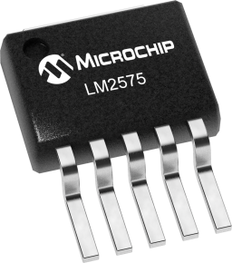
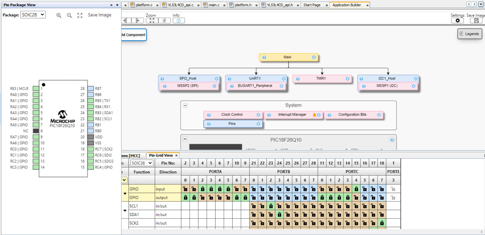
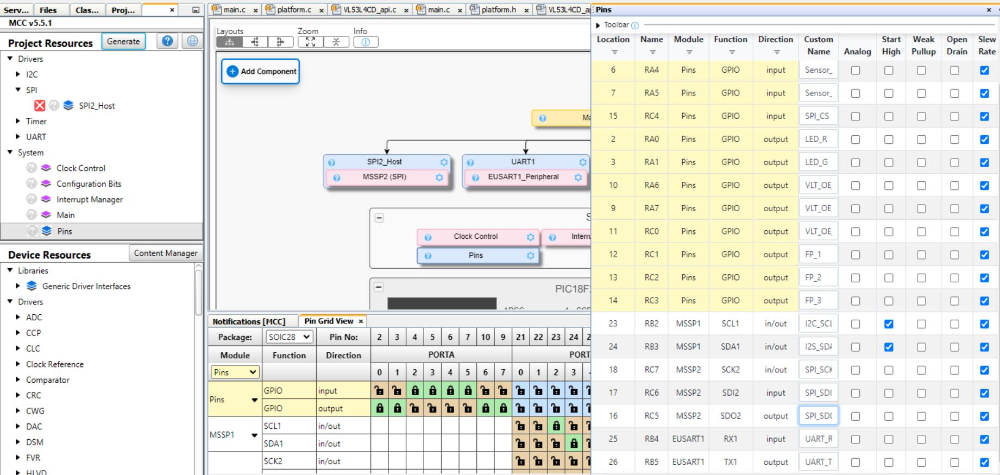
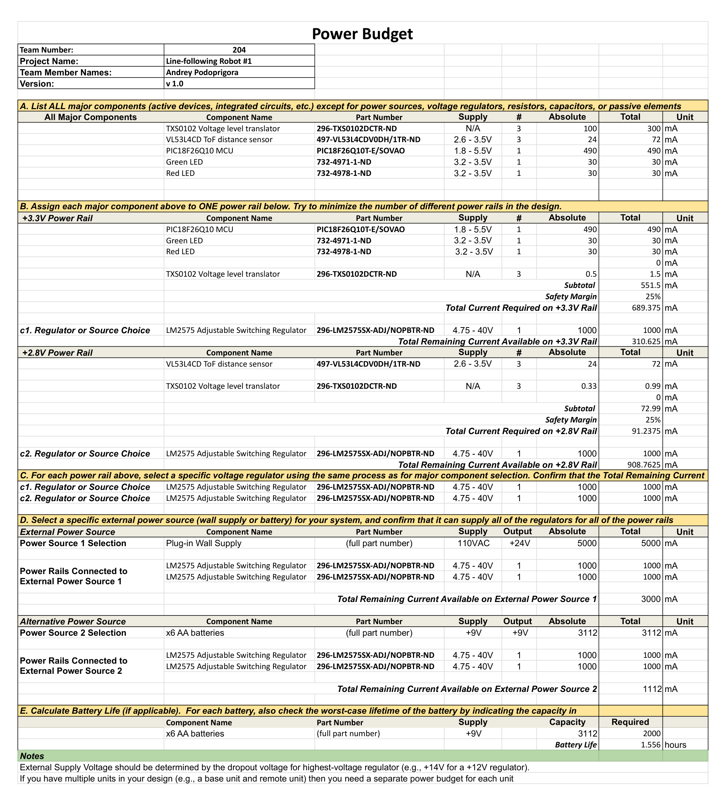

# 1. Major Component Selection

### Inroduction to the Component Selection Process
The type of sensor proposed and selected earlier for this semester’s group project is a **distance measuring** sensor. Nowadays, a variety of physical phenomena is utilised to create this type of sensors, including, but not limited to: infrared emitting, ultrasonic “listening” and laser-based detection. Taking into account the guidelines of the current project, the sensor selection process was performed under the following considerations: the sensor chip should incorporate at least 1 serial communication interface(I2C, SPI or UART); the sensor chip shall not exceed the volumetric borders of imaginary parallelepiped with dimensions of 3x3x1.5 cm; the sensor chip should not come from the manufacturer as a part of “daughterboard”-type PCB, unless the chip itself is too small or excessively complex to be manually soldered on the self-designed PCB (although the team member can decide to either incorporate the sensor into a single PCB with MCU, or to allocate it to its own "daughterboard", the second option is more preferred considering the project's device format and the correlated need to dislocate at least three sensors, poitning into different directions from the horizontal plane)

### Updates and changes to the Component Selection Process
Although, the Component Selection configuration depicted on this webpage wasn't radically modified or adjusted, a couple of noticeable changes were inevitable to occur along the path of correcting the previously-unknown structural discrepancies and ineffective electrical/mechanical solutions. 
One of the most important updates, is the so-called _"paradigm shift"_ in regards to the approach of organizing the power delivery to the distance sensors. As it was mentioned in the previous documents(e.g. Block Diagram), the powering scheme of the ToF distance sensors was defined to rely on a **2.8V supply**, instead of a **standartised 3.3V**. In order to account for this design rule, the first version of the Component Selection outline offered a **"one-for-each"** solution - each sensor daughterboard was supposed ot be equipped with **its own 2.8V LDO Voltage regulator**. After conducting a thorough review and analysis of the feedback received during the External Design Review, a decision was made to shift from the **"one-for-each"** strategy towards a **shared power source-based structure**. Instead of 3+ LDO regulators, a single Switching Voltage regulator concept was introduced - this regulator, configured to output **exactly 2.8V**, would stand on the same "motherboard" as the main, **3.3V regulator**, and both regulators will be parallelly "tied" to the external 9V power supply(for simplicity of parts ordering, and PCB design, a decision was made to use a single model of a Switching Voltage Regulator - LM2575). A sample distance sensor daughterboard, in its order, will get access to that power supply over a **jumper wire pair (+2.8V & GND)**, that is supposed to connect to the male pin header/-s, integrated directly into the motherboard.
Along with this, in order to sycnhronise and balance the serial communication between **a 3.3V-powered MCU and a 2.8V-powered sensors**, a Voltage Level Translators were incorporated into the structure of each sensor's daughterboard, in order to handle the data transfer processes on SDA and SCL lines. Schematic representation of how exactly the Voltage Level Translators are connected to the surrounding circuit elements in order to perfrom the previously-mentioned "translations" will be described in details at the Subsystem Schematics page
## 1.Distance Sensor Selection

| **Solution**                                                                                                                                                                                      | **Pros**                                                                                                                                    | **Cons**                                                                                            |
| ------------------------------------------------------------------------------------------------------------------------------------------------------------------------------------------------- | ------------------------------------------------------------------------------------------------------------------------------------------- | --------------------------------------------------------------------------------------------------- |
|  \* Option 1.  \* VL53L4CD Time-of-Flight high accuracy low power proximity sensor   \* $1/each   \* [link to product](https://www.digikey.com/en/products/detail/stmicroelectronics/VL53L4CDV0DH-1/16123783?s=N4IgTCBcDaIGoBkCsBmBAWAwgERAXQF8g)                 | \* Provides up to 1.3 meters of scanning distance range \* Extremely compact and miniature (4.4 x 2.4 x 1 mm size) \* Successfully operates under the standardized power supply of 3.3 Volts \* Capable of reaching the communication frequency up to 1 MHz (I2C-based) \* Incorporates a system driver based on the so-called “Ultra Light Driver” (ULD) - an API set developed by manufacturer(STMicroelectronics) as a uniform solution for various sensor models, that is actively supported and updated| \* Comes in a Land Grid Array(LGA)-type packaging, which is expected to be hard for traditional(solder iron-based) soldering (12 pins in total) \* Provides Field of View(FoV) angle of only 18 degrees within a single plane |
|  \* Option 2.   \* VL53L8CH high performance 8x8 multi zone Time-of-Flight (ToF) sensor   \* $8.53/each   \* [Link to product](https://www.digikey.com/en/products/detail/stmicroelectronics/VL53L8CHV0GC-1/21191534?s=N4IgTCBcDaIGoBkCsBmBAOAwgCRAXQF8g) | \* Capable of performing scanning within a broad FoV, reaching the detection range within 45 degrees across the center of the sensor both in vertical and horizontal planes  \* Supports both I2C and SPI interfaces for communication with the Host MCU   \* Capable of detecting objects located as far as 4 meters(!) from the sensor | \* Comes in a Land Grid Array(LGA)-type packaging, which is expected to be hard for traditional(solder iron-based) soldering (17 pins in total)  \* Typical application schematic suggest the production of a developed Host MCU-to-sensor connection structure with noticeable amount of circuit elements(7 distinct resistors and 3 capacitors), which complicates the design process of the associated PCB|
|  \* Option 3.   \* VL53L1CXV0FY/1 long distance ranging Time-of-Flight sensor   \* $5.77/each   \* [Link to product](https://www.digikey.com/en/products/detail/stmicroelectronics/VL53L1CXV0FY-1/8276742) | \* Provides a single-plane FoV of 27 degrees both in horizontal and vertical planes  \* Support switching between 3 “Distance Modes” (short, medium & long), varying at the maximum range of scanned distance, that allow to optimize the object detection processes  \* Capable of detecting objects located as far as 4 meters(!) from the sensor | \* Comes in a Land Grid Array(LGA)-type packaging, which is expected to be hard for traditional(solder iron-based) soldering (17 pins in total)  \* Capable of communicating with the Host MCU at the maximum rate of only 400 kHz  \* Provided with an older, single model-based version of VL53 family API for the system driver |

### Choice:
Option #1 => **VL53L4CD** Time-of-Flight high accuracy low power proximity sensor

### Rationale:
Based on the data, presented in the chart above, the most reasonable choice for the sensor subsystem in the scope of the current project would be the **VL53L4CD** (option #1). It possesses adequate object detection range (up to 1.3) meters, provided with a modern and well-supported API for a system driver, and, what is especially important being reminded the usage context - distance sensor within an object-following robot - it can communicate with the Host MCU at the rate of 1 MHz across the I2C channel. In comparison to it, **VL53L8CH** (option #2) would clearly be an “overkill” - even despite the double price range in comparison to the first option, it is simply “overprovided” with excessive functionality, that wouldn’t be much relevant within the scope of the project(multizone data output, 4x4 matrix for gathering data from the multiple points within the FoV at a time, AI-supported features). At the same time, the **VL53L1CXV0FY/1** (option #3) looks a lot similar to the option #1, however, it possess a significant drawback, represented by its I2C communication speed being less than half of the same parameter from **VL53L4CD**  - 400 kHz to 1 MHz - which may significantly affect the operation potential of a fast-moving system, such as the team project’s future robot.

## 2. Adjustable Switching Regulator (3.3V and 2.8V) Selection

| **Solution**                                                                                                                                                                                      | **Pros**                                                                                                                                    | **Cons**                                                                                            |
| ------------------------------------------------------------------------------------------------------------------------------------------------------------------------------------------------- | ------------------------------------------------------------------------------------------------------------------------------------------- | --------------------------------------------------------------------------------------------------- |
|  \* Option 1.  \* LM2575 Swithcing Voltage Regulator   \* $1.27/each   \* [link to product](https://www.digikey.com/en/products/detail/texas-instruments/LM2575SX-ADJ-NOPB/366783)                 | \* Includes a fixed-frequency oscillator \* Incorporates internal frequency compensation \* The feedback voltage is guaranteed ot +- 2% tolerance  \* Output can be easily adjusted from from 1.23 to 37 V(!!!) based on different voltage-dividing resistors combinations| \* The offered packaging is relatively big compared to the alternatives, meaning that less space is available on the motherboard for the rest of the circuitry \* Noticeable pin size -> might be problematic for standart SMD soldering throuhg the hot air reflow, might require soldering iron|

## 3. Voltage Level Translator Selection

| **Solution**                                                                                                                                                                                      | **Pros**                                                                                                                                    | **Cons**                                                                                            |
| ------------------------------------------------------------------------------------------------------------------------------------------------------------------------------------------------- | ------------------------------------------------------------------------------------------------------------------------------------------- | --------------------------------------------------------------------------------------------------- |
|  \* Option 1.  \* TXS0102DCTR Voltage Level Translator   \* $0.49/each   \* [link to product](https://www.digikey.com/en/products/detail/texas-instruments/TXS0102DCTR/1632642)                 | \* No direction control signal needed \* No power-supply sequencing required: either VCCA or VCCB can be ramped first \* Known and recongised for use in setting up serial communication channels of I2C and SPI formats  \* Noticeably small and compact, a great fit for daughterboard-type PCB-s| \* Must be soldered with care and caution due to the tiny size \* Requires a HIGH input signal from the MCU in order to operate; won't let the A and B signals pass through while in "passive mode"|

## 4. Microcontroller Selection
### Declaration of Personal Role & Responsibilities Within the Team 
The selected concept for the Spring 2025 semester project by team #204  is a bi-wheeled robot with object-following capabilities. Within the scope of this project, my primary responsibility area is focused around **sensing functionality** of the proposed robotic device. In this regard, I proposed the design involving placement of 3 identical Time-of-Flight(ToF) sensors in the frontal part of the robot, each directed outwards to the robot’s center  in order to increase the Field of View available to the device. The process of selecting the actual market-available sensor solution was performed earlier in this document(the final choice was identified to be VL53L4CD). In order to transfer the observed data to the Host MCU, all three sensors will be using a single I2C bus (the approximated communication speed is expected to vary between 0.75-1 MHz). After the data was received and pre-processed(e.g. unit conversion) by the Host MCU, it will then be transferred to the neighboring MCU in the systems’ UART daisy chain.

### Proposed Microcontroller Solution: **PIC18F26Q10***

| PIC MCU Info                                      | Answer |
| --------------------------------------------- | ------ |
| Model                                         |      PIC18F26Q10   Packaging type: SOIC/28     |
| Product Page URL                              | [link](https://www.microchip.com/en-us/product/pic18f26q10#Design%20Resources)                                    |
| Datasheet URL(s)                              | [link](https://ww1.microchip.com/downloads/aemDocuments/documents/MCU08/ProductDocuments/DataSheets/PIC18F24-25-Q10-Data-Sheet-DS40001945.pdf)                                              |
| Application Notes URL(s)                      | [link](https://ww1.microchip.com/downloads/aemDocuments/documents/MCU08/ProductDocuments/Errata/PIC18F2425Q10-Silicon-Errata-Data-Sheet-Clarifications-DS80000797.pdf)                                              |
| Vendor link                                   | [link](https://www.microchip.com)                       |
| Code Examples                                 | [Github link](https://github.com/microchip-pic-avr-examples?utf8=✓&q=pic18f47q10&type=&language=)   [Microchip link](https://mplabxpress.microchip.com/mplabcloud/example?author=microchip&device=pic18f25q10) |
| External Resources URL(s)                     | [link 1](https://www.northernsoftware.com/dev/pic18f/pic18f25q10.htm)                       |
| Unit cost                                     | $1.11                                                            |
| Supply Voltage Range                          | 1.8V to 5.5V                                                 |
| Absolute Maximum current   (for entire IC) | 350 mA      |                                                                                      |
| Maximum GPIO current   (per pin)           | ± 50 mA                                                                                     |
| Supports External Interrupts?                 | Yes                                                                                     |
| Required Programming Hardware, Cost, URL      | MPLAB® SNAP   cost: $14.99(also provided within EGR314 standart student kit)   [URL](https://www.microchip.com/en-us/development-tool/PG164100)                                                               |
| Works with MPLabX?                            | Yes(chip is a direct product of Microchip)                 |
| Works with Microchip Code Configurator?       | Yes(chip is a direct product of Microchip)                                                         |

### Program Modules Diagram

| Module | # Available | Needed | Associated Pins (or * for any) |
| ---------- | ----------- | ------ | ------------------------------ |
| GPIO       | 12          | 12     | 2, 3, 4, 5, 6, 7, 9, 10, 11, 12, 13, 14|
| ADC        | -           | 0      | -                              |
| UART       | 1           | 1      | 6, 7, 25, 26                   |
| SPI        | 1           | 1      | 15, 16, 17, 18                 |
| I2C        | 1           | 1      | 23, 24                         |
| PWM        | -           | 0      | -                              |
| ICSP       | 1           | 1      | 1, 27, 28                      |
| ...        | ...         | ...    | ...                            |

### Pinout and Modules Demonstration in MPLABX
 

The **picture above** demonstrates the pin allocation within the PIC18F26Q10, proposed as the sensor subsystem microcontroller, performed within the MPLAB X software environment. The pin distribution goes as follows:   
UART => pins **# 6, 7, 25, 26**  
SPI(back-up serial interface, not intended for use in the standart configuration) => pins **# 15, 16, 17, 18**  
I2C => pins **# 23, 24**  
Sensor Hardware Interrupt => pins **# 5, 6, 7**  
Voltage Level Translator Output Enable => pins **# 9, 10, 11**  
Red LED => pin **# 2**  
Green LED => pin **# 3**  
PushButton => pin **# 4**  
Reserve GPIO pins(provided with a male header-type output on the PCB) => pins **# 12, 13, 14**   
	
The **picture below** demonstrates the detailed outline of the selected pin allocation, sorted by the type and module affiliation(General I/O, UART, SPI, I2C)

 

### PIC18F26Q10 Selection Rationale
I perceive the PIC18F26Q10 to be the optimal choice for the sensor subsystem of the robotic device proposed within our team’s project. While being a part of a high-performing PIC18 chip family, this chip hosts only 28 pins in comparison to the standard 40-pin PIC18F47Q10 chip that is used as a general purpose MCU within the EGR314 course. By excluding 12 excess pins, the PIC18F26Q10 will help to reduce the size of both the subsystem’s PCB and project’s device - which is definitely important, being reminded the context of the devices’ operation - mobile, fast-moving robot. Along with this, the selected MCU’s operating speed of 64 MHz will be capable of providing instant communication with both the UART-based neighbor MCU-s, and three ToF sensors, placed on a single I2C bus(each operating on approximate communication speed of 1MHz), while 2048 bytes of RAM and 32K bytes of Flash Memory will provide for the flawless processing of the data received from the mentioned sensors.   

# 2. Power Budget

### Notes on the Power Budget
Provided Power Budget outline represents the most recent version of the target document, accounting for all the mentioned changes/modifications conducted to the Component Selection configuration. The general set-up was split between two power rails - 2.8V accounting for power within the ToF sensor daughterboards, and 3.3V "taking responsibility" for the motherboard's power accordingly. Along with this, current version of the Power Budget takes into consideration the current and power influences generated by both the three ToF sensors and their Voltage Level Translator modules.

