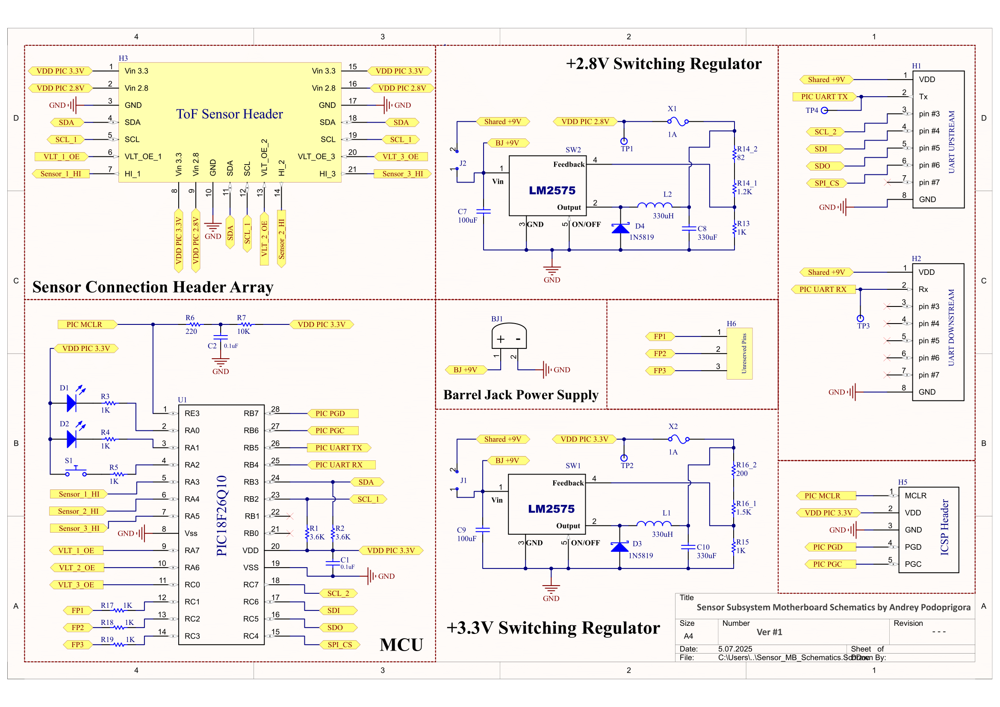
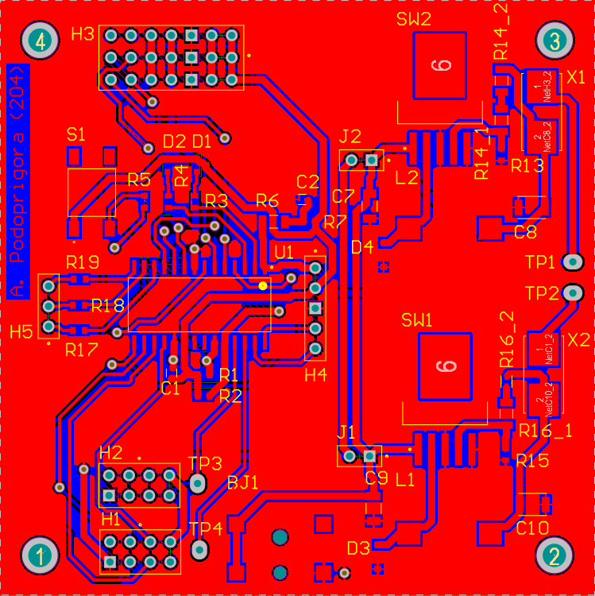
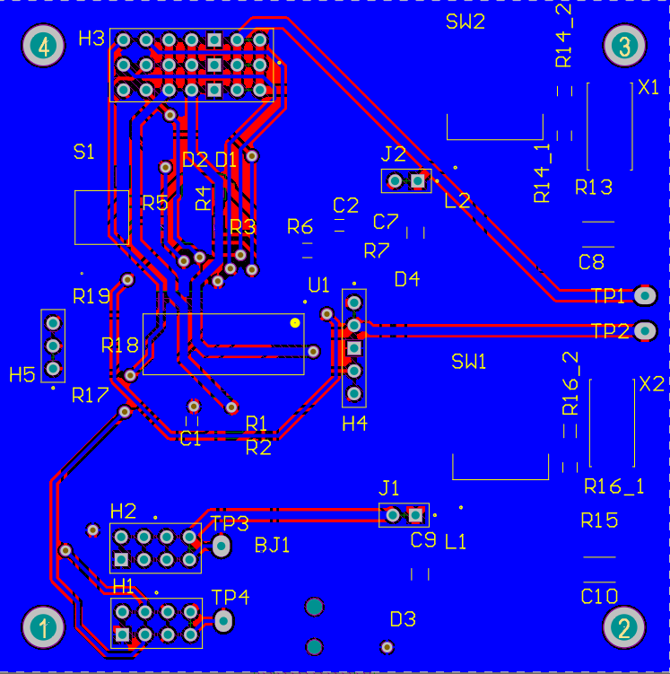
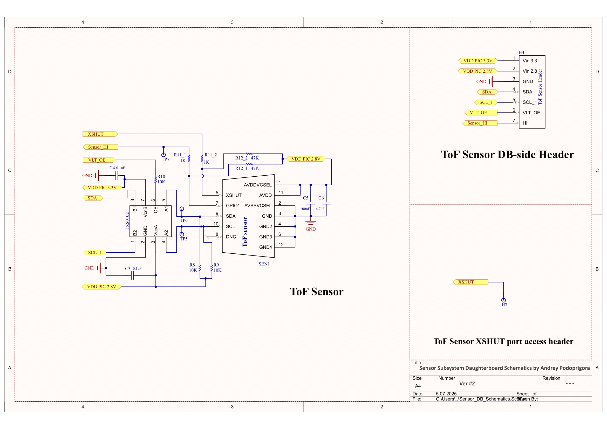
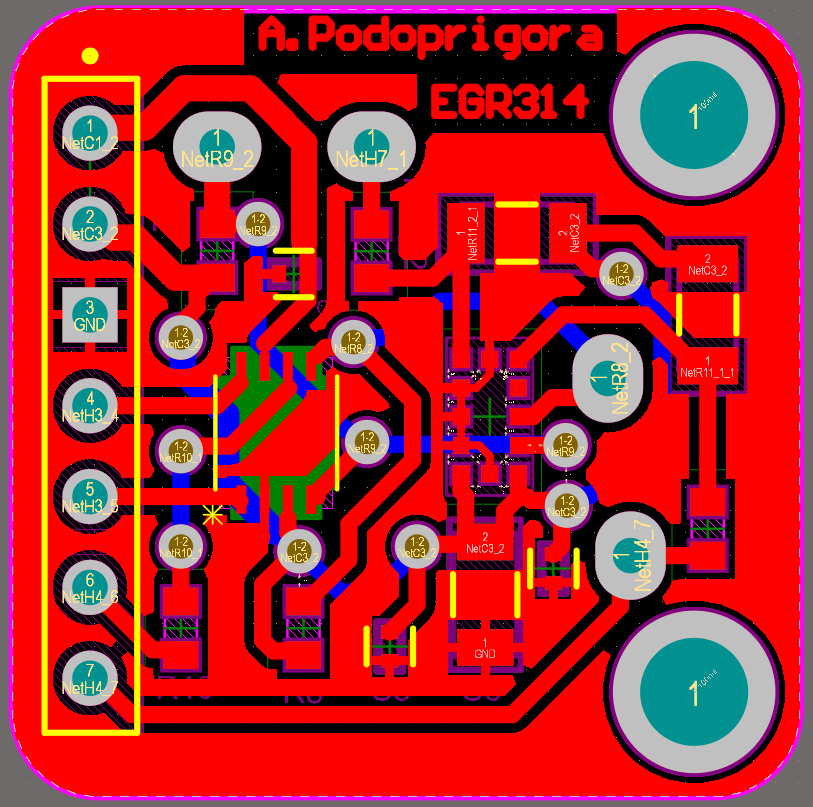
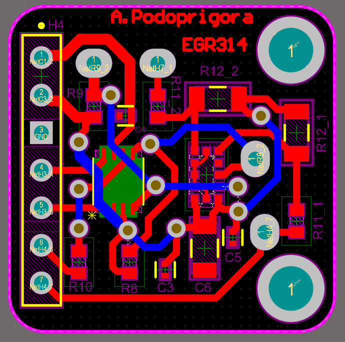
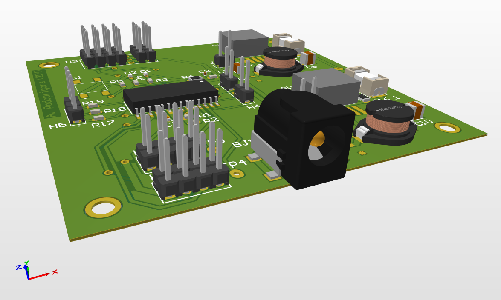
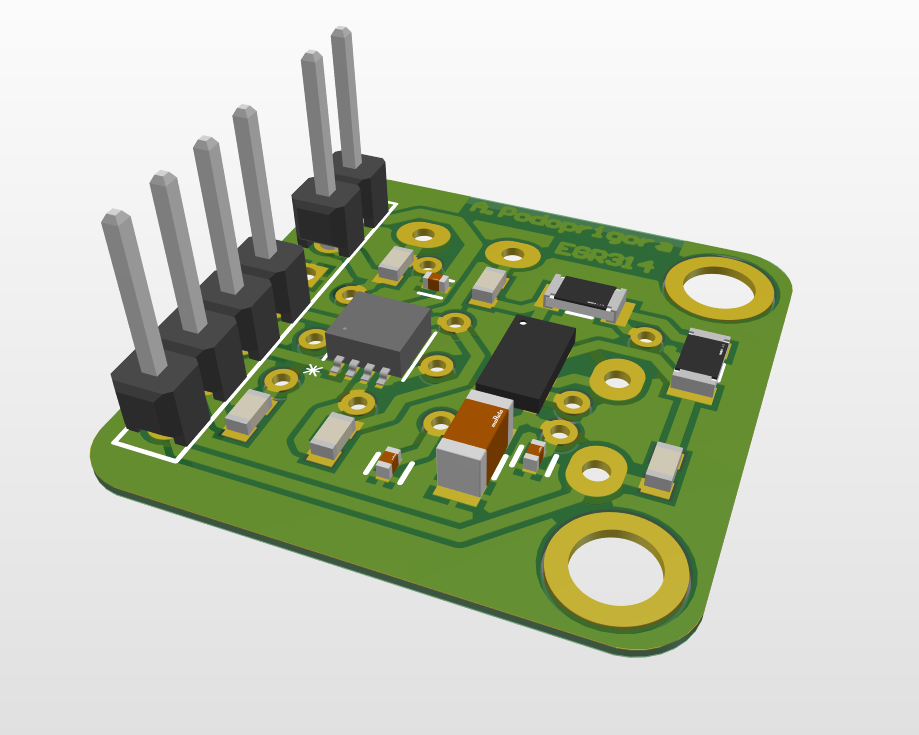
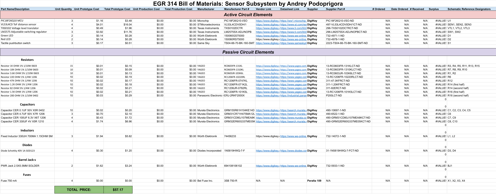

## 1) Schematics, Diagrams and Image Captures

### Motherboard Subsystem Schematics

### Motherboard Front-side PCB Outline

### Motherboard Back-side PCB Outline

### [sensor-hosting] Daughterboard Subsystem Schematics

### Daughterboard Front-side PCB Outline

### Daughterboard Back-side PCB Outline

### Motherboard Isometric View

### Daughterboard Isometric View

### Final Bill of Materials 

## 2) Discussion, Evaluations and Suggestions

In order to find out how the board, captured on the diagrams above, had "shown itself in practice", we decided to directly ask about it the creator, Andrey Podoprigora. Here is what he told us about his experience of working with the board during the last two months!:
" - Thank you so much for contacting me on that occasion"

## 3) Related Links and References

[Link to the PDF version of the schematics(Motherboard and Daughterboard) shown above](https://github.com/LordAndrey17/andreypodoprigora.github.io/blob/main/docs/Summary_Schematics.pdf)

[Link to the summary Altium™ project zip archive](https://github.com/LordAndrey17/andreypodoprigora.github.io/blob/main/docs/Podoprigora_Altium_Project_Final_release.zip)

[Link to the gerber files zip archive(Motherboard & Daugtherboard)](https://github.com/LordAndrey17/andreypodoprigora.github.io/blob/main/docs/Gerber_Cumulative.zip)

[Link to the PDF version of the table shown above](https://github.com/LordAndrey17/andreypodoprigora.github.io/blob/main/docs/PBOM.pdf)

[Link to the Google Sheets version of the table shown above](https://docs.google.com/spreadsheets/d/1AKsVAjezf8IYZDiDhJCl3jdnxlUkPmnE/edit?usp=sharing&ouid=117176938971734382879&rtpof=true&sd=true)

